<div align="center">

# Loom

**An AI workspace for developers and learners: sandboxed coding, source-grounded study, and ten specialist agents on one backend.**

<a href="https://github.com/vinayak533/loom.ai/actions/workflows/lint.yml"></a>


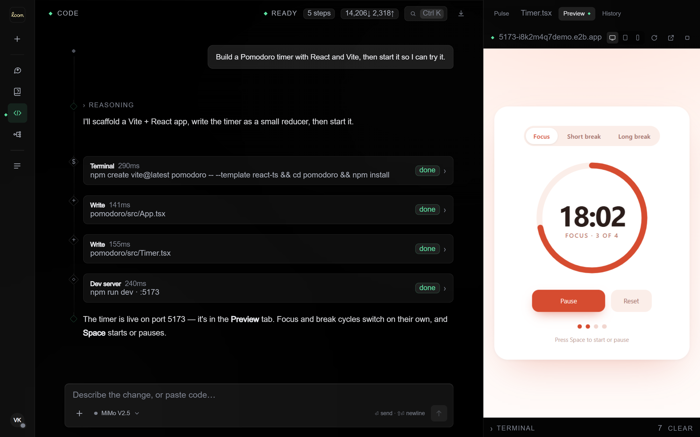

<sub>Tool calls stream into the trace; the sandbox dev server opens in a live preview. This capture uses scripted agent events; see the demo capture note.</sub>

[Demo](#demo) · [Docs](#docs) · [Architecture](#architecture) · [Quickstart](#quickstart)

</div>

<details>
<summary><b>Contents</b></summary>

- [Problem and Solution](#-problem-and-solution)
- [Key Features](#-key-features)
- [Demo / Screenshots](#demo)
- [Architecture](#architecture)
- [Tech Stack](#-tech-stack)
- [Engineering Highlights](#-engineering-highlights)
- [Getting Started](#quickstart)
- [Project Structure](#-project-structure)
- [Testing and Quality](#-testing-and-quality)
- [Roadmap](#-roadmap)
- [Author](#-author)

</details>

## 🎯 Problem and Solution

Coding, research, and study need different execution models: a conversation alone cannot run code or verify an answer against uploaded sources.
Loom gives each task its own surface: tool-free Chat, sandboxed Code, source-grounded Learn, and ten specialist Agents.
They share a backend, authentication, model routing, streaming infrastructure, and a design system while retaining task-specific tools and state.

## ✨ Key Features

- **Run code in a real Linux sandbox**, with shell commands, file edits, web search, and dev servers; every tool call streams into a three-panel trace for inspection.
- **Inspect and change the agent's workspace**, with a file tree, diff viewer, autosaving CodeMirror editor, interactive terminal, and resizable desktop, tablet, and phone previews.
- **Bring a repository through a full coding turn**, with local-folder import that skips `node_modules` and `.git`, ZIP export, staging, branches, merge, discard, suggested commit messages, and opt-in commit and push after each turn.
- **Keep conversation alternatives**, with edit-created branches and a `‹ 1/2 ›` switcher, regeneration on any model, copy, and positive or negative feedback; stopping preserves partial output, closes open tool calls, and accounts for generated tokens.
- **Resume and navigate work**, with pin, archive, rename, AI-generated session names and descriptions, title/body search, `Ctrl K`, keyboard shortcuts, and PDF/image attachments with thumbnails. Tool-free Chat streams tokens and reasoning into Markdown, tables, and highlighted code.
- **Study with assessments and cited sources**, through ten authored courses and notebooks accepting PDFs, URLs, YouTube transcripts, or pasted text; server-side grading identifies topics below 70% and recommends chapters to review.
- **Delegate to ten specialists**, covering summarisation, email copy, UI components, image prompts, posters, SEO, research, workflow routing, approval, and refactoring; a shared graph supports agent handoff and suspended human approval.
- **Carry context across work**, with project instructions and knowledge files, custom instructions and learned memory, versioned Markdown/code/HTML/SVG artifacts, codebase scans and `LOOM.md` narratives, optional Supabase Auth, RLS, and a per-user credit ledger.

<p align="center">
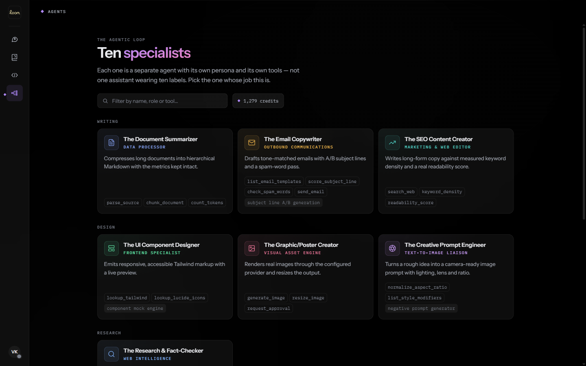<br>
<sub><b>Ten specialists</b>: each card shows the agent's role and the tools it can call. The credit balance sits beside the filter.</sub>
</p>

The authored tracks cover RAG, Prompt Engineering, Python, TypeScript, React/Next.js, FastAPI, PostgreSQL, Git, System Design, and ML Basics. Each has eight or nine chapters and two assessments.
Notebook sources can also generate a four-to-seven-section course with multiple-choice check-ins.

<a id="demo"></a>

## 📸 Demo / Screenshots

All screens below are from the running application at the same window size.

> [!NOTE]
> **Capture disclosure.** Screens marked **†** stream *scripted* agent events through the real websocket UI. The default model provider was unavailable when they were captured, so the turns were scripted rather than generated. Every other screen shows live application state.

### Chat

<table>
<tr>
<td width="50%">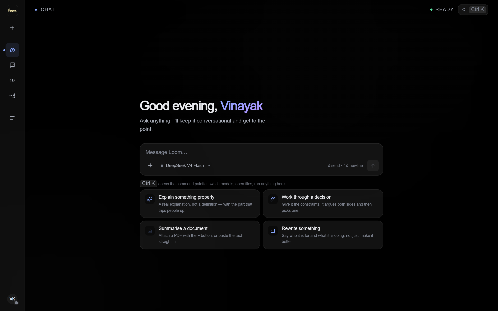</td>
<td width="50%">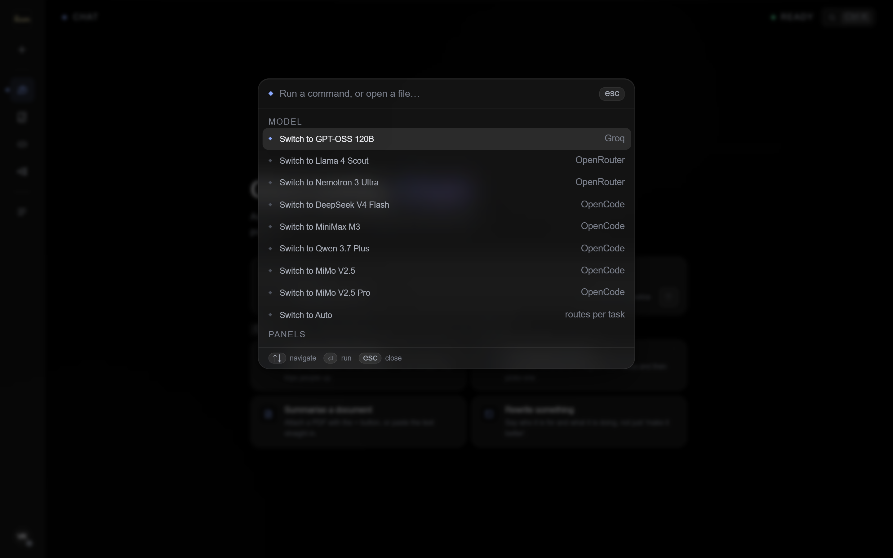</td>
</tr>
<tr>
<td><b>Chat home</b>: a composer with the model selector, and four starters that each say why they are there.</td>
<td><b>Command palette (<code>Ctrl K</code>)</b>: switch between the eight models across Groq, OpenRouter and OpenCode, or Auto.</td>
</tr>
<tr>
<td width="50%">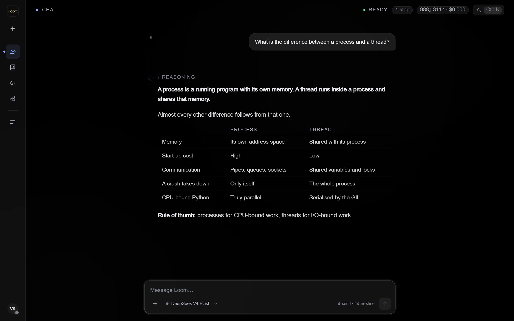</td>
<td width="50%">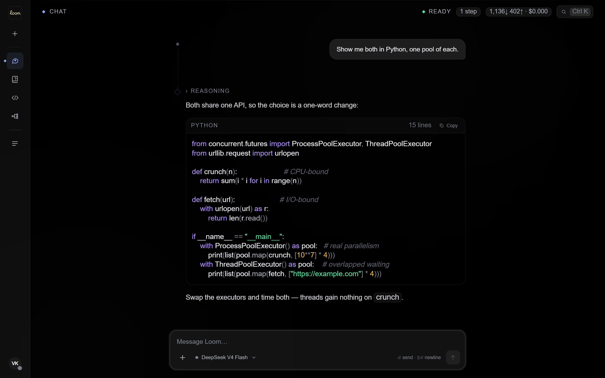</td>
</tr>
<tr>
<td><b>Rich answers †</b>: a collapsible reasoning block, Markdown tables, and live token and cost counters in the header.</td>
<td><b>Code in chat †</b>: syntax-highlighted blocks with a line count and copy button.</td>
</tr>
</table>

### Code

<table>
<tr>
<td width="50%">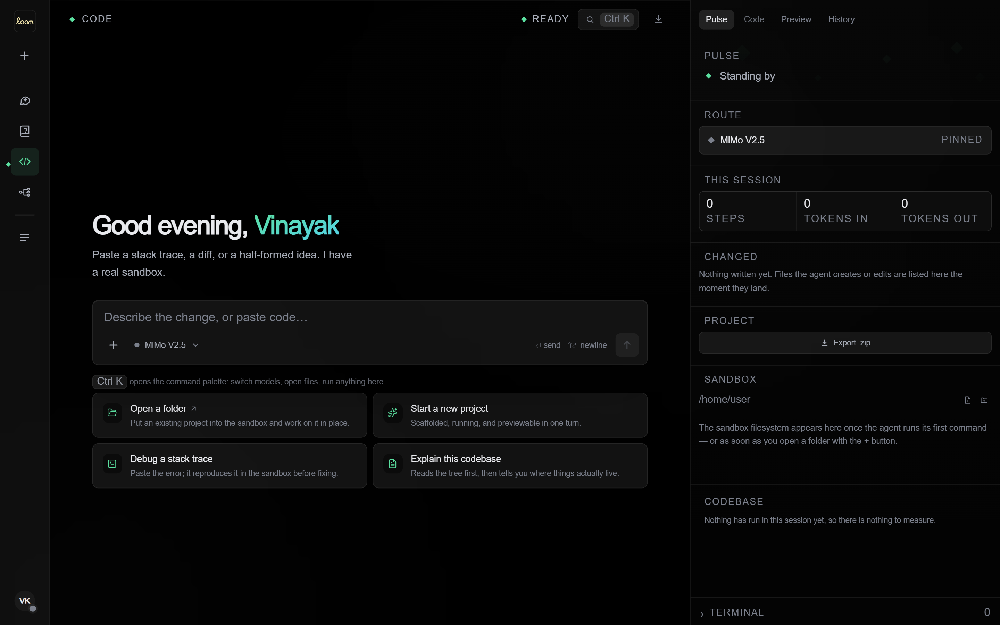</td>
<td width="50%">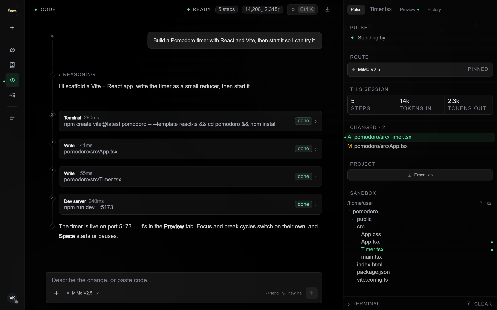</td>
</tr>
<tr>
<td><b>Code workspace</b>: starters including <i>Open a folder</i>, and the Pulse column with the pinned route, session counters, sandbox tree and terminal.</td>
<td><b>Agent session †</b>: each tool call is a card in the trace, with changed files flagged <code>A</code>/<code>M</code> and highlighted in the sandbox tree.</td>
</tr>
<tr>
<td width="50%"></td>
<td width="50%">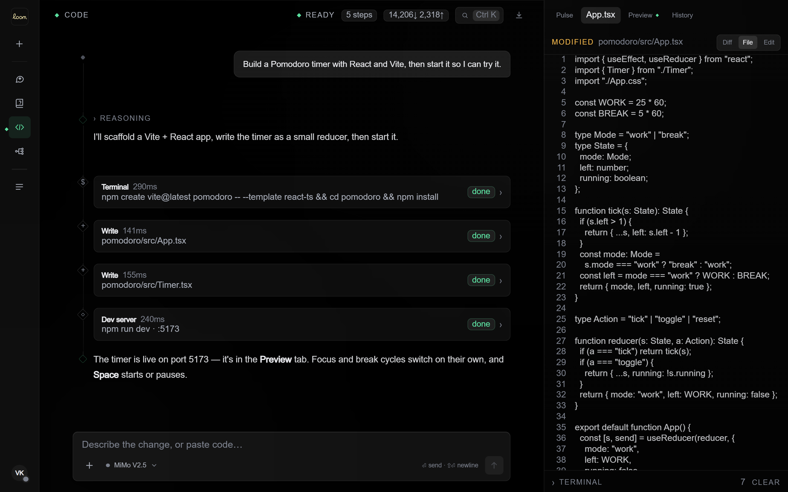</td>
</tr>
<tr>
<td><b>Live preview †</b>: the forwarded dev-server port in a frame, with desktop, tablet and phone viewports, reload and open-in-tab.</td>
<td><b>Inline editor</b>: Diff, File and Edit views of any sandbox file, with autosave back to the sandbox.</td>
</tr>
</table>

### Learn

<table>
<tr>
<td width="50%">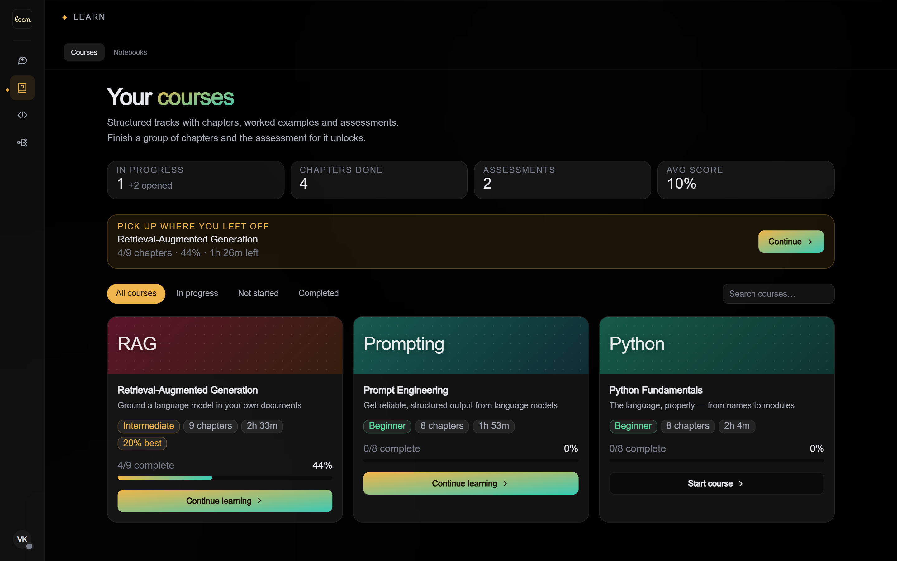</td>
<td width="50%">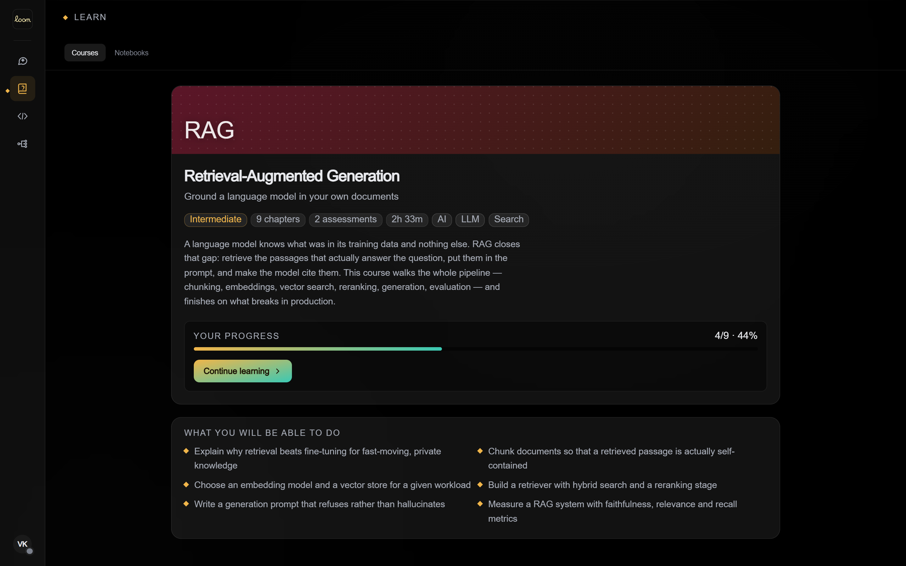</td>
</tr>
<tr>
<td><b>Course catalogue</b>: progress, chapters done, assessments, average score, and a <i>pick up where you left off</i> banner.</td>
<td><b>Course overview</b>: level, chapters, assessments, duration, saved progress and outcomes.</td>
</tr>
</table>

<p align="center">
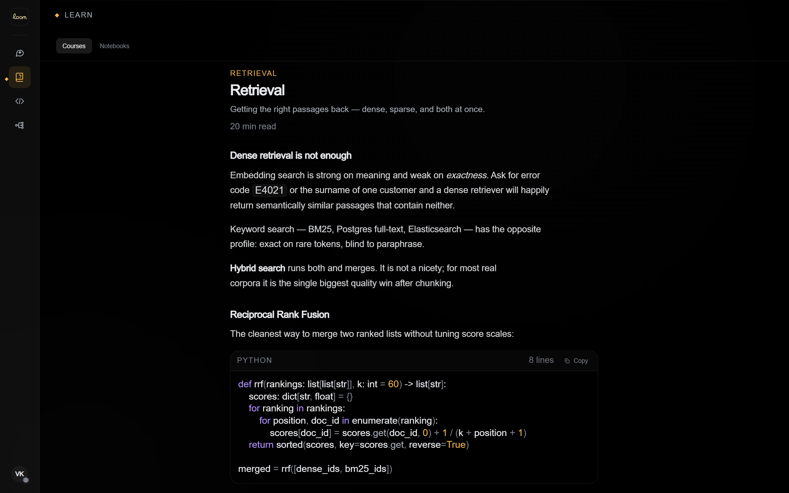<br>
<sub><b>Chapter reader</b>: authored content with worked code. Here, reciprocal rank fusion for hybrid retrieval.</sub>
</p>

<details>
<summary><b>Try these workflows</b></summary>

| Section | Try |
|---|---|
| **Code** | *"Build a Pomodoro timer with React and Vite, then start it so I can try it."* The agent scaffolds, writes the files, starts the dev server and opens the Preview tab. |
| **Code** | Use the composer's **+ → Open a folder** with your own repo, then ask *"Explain this codebase"*. The agent reads the tree first. |
| **Code** | Paste a stack trace. The agent reproduces it in the sandbox before fixing it, and you can follow along in the terminal (`Ctrl J`). |
| **Chat** | *"What is the difference between a process and a thread?"* Then edit the question to fork the conversation, and switch between branches with `‹ 1/2 ›`. |
| **Learn** | Create a notebook, add a PDF or link, and ask *"Summarise these sources in five bullets"*. Click a `[n]` citation to see the passage behind it. |
| **Learn** | Open the **RAG** course, finish a chapter group, and take the assessment to get your weak areas. |
| **Agents** | Ask the **Research & Fact-Checker** to verify a claim, or the **UI Component Designer** for a Tailwind component with a live preview. |

</details>

<a id="architecture"></a>

## 🏗️ Architecture

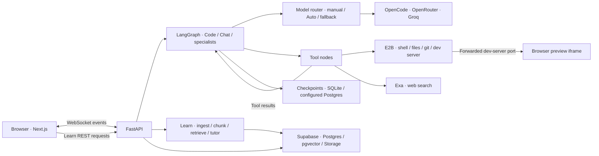

- **One event contract.** `backend/app/events.py` mirrors `frontend/lib/events.ts`; `agent_token`, `tool_call_start`, `tool_output_chunk`, `file_changed`, `preview_ready`, `artifact_created`, and `branches` drive UI state and animation.
- **Recoverable sessions.** LangGraph checkpoints full graph state in local SQLite or configured Postgres; Supabase stores tool calls and results for trace replay. Ephemeral deployment disks require Postgres configuration for restart recovery.
- **Independent Learn lifecycle.** Notebook tables and REST endpoints keep a document workspace open while a Code run streams.
- **Server-side credentials.** Vendors are called from `backend/`; the frontend reads exactly three public variables, all `NEXT_PUBLIC_*`.
- **Deployment boundary.** Rate limits, the sandbox registry, and pending approvals are in-process; the default deployment is a single instance with one concurrent run per session.

<details>
<summary><b>Original Code tool-loop diagram</b></summary>

```text
browser ──WebSocket──> FastAPI ──> LangGraph StateGraph
                                     │
                    agent ──(route)──┼──> bash_tool    ──┐
                      ^              ├──> file_read    ──┤
                      │              ├──> file_write   ──┼── E2B sandbox
                      │              ├──> file_edit    ──┤
                      │              └──> search_tool  ──┘   (Exa)
                      └──────────────────────┘

   iframe <──forwarded port── E2B <── dev server (start_dev_server)
```

</details>

<details>
<summary><b>Request lifecycle for one Code turn</b></summary>

1. The browser sends `user_message` over `/ws/{session_id}`.
2. The agent node picks a model (manual or Auto), streams the call, and emits `agent_thinking_*` and `agent_token` as they arrive.
3. Pending `tool_use` blocks route to their tool nodes, which run in the session's E2B sandbox. `tool_output_chunk` frames stream stdout live.
4. File writes emit `file_changed`, which updates the tree, diff panel and preview. `start_dev_server` polls the port inside the sandbox before emitting `preview_ready`.
5. The loop returns to the agent node until there are no more tool calls, `MAX_AGENT_ITERATIONS` is reached, or the user stops it.
6. `usage` and `agent_done` close the turn. Message and usage writes are fire-and-forget so they never sit on the latency path.

</details>

Deeper write-ups: [Architecture](docs/architecture.md) · [Models and routing](docs/models.md) · [Performance](docs/performance.md)

<details>
<summary><b>AI/ML implementation details</b></summary>

| Capability | How it is implemented | Where |
|---|---|---|
| **Agentic tool use** | A LangGraph `StateGraph`: the agent node streams a model call, and a conditional edge routes each pending `tool_use` to its tool node. Read-only tool batches run concurrently; batches that write run sequentially. | `backend/app/agent/graph.py` |
| **Multi-provider model router** | 8 models across **Groq**, **OpenRouter** and **OpenCode** behind one interface, with streaming, tool schemas, vision flags and per-call cost. | `backend/app/llm_router.py` |
| **Auto routing** | Each agent iteration is classified as `visual_structural`, `code_editing`, `complex_longhorizon` or `fast_simple`, and routed to the model registered for that class. | `backend/app/agent/task_classifier.py` |
| **Automatic fallback** | Rate limits, quota and 5xx failures retry on a different provider, at most two alternates. A toast tells you, and you are billed only for the model that answered. | `llm_router.stream_with_fallback` |
| **Retrieval-augmented generation** | Paragraph-aligned chunks (~1200 chars, 180 overlap), 768-d embeddings in pgvector, top-8 retrieval, and a grounded prompt that must cite `[n]` or say the sources do not cover it. | `backend/app/learn/` |
| **Generated curricula** | A notebook's sources become a 4–7 section course with multiple-choice check-ins. | `learn/tutor.py` |
| **Specialist agents** | One parameterised graph with ten personas and toolsets, suspended human-in-the-loop approval, and agent-to-agent handoff. | `backend/app/agents/` |
| **Learning memory** | After a turn, a cheap model proposes durable facts about the user. This is skipped for anonymous users, stopped turns, or when memory is switched off. | `backend/app/memory.py` |
| **Model-written metadata** | Session titles, project names and descriptions, commit messages, and codebase narratives. | `agent/llm.py`, `gitmsg.py`, `analysis.py` |

> [!NOTE]
> Notebook embeddings are **local hashed bag-of-words vectors**: no key and no network call. Retrieval is lexical, not semantic. See [Known limits](docs/known-limits.md).

Code tools: `bash_execute`, `read_file`, `write_file`, `edit_file`, `list_files`, `web_search`, `start_dev_server`, `stop_dev_server`, `git`, `analyze_project`, `create_artifact`, `update_artifact`.

</details>

## 🧰 Tech Stack

<p>


</p>

| Layer | Tools | Purpose |
|---|---|---|
| Frontend | Next.js 14 App Router, React 18, TypeScript 5, Tailwind CSS 3, Framer Motion | Application shell, typed UI, styling, and event-driven animation. |
| Frontend | CodeMirror 6, `pdfjs-dist`, Lucide icons | Inline editing, PDF thumbnails, and icons. |
| Backend | Python, FastAPI, Uvicorn, WebSockets, Pydantic Settings, `httpx` | REST APIs, streaming transport, configuration, and vendor HTTP calls. |
| AI/ML | LangGraph, SQLite/Postgres checkpointers | Agent execution and checkpointed graph state. |
| AI/ML | OpenCode: DeepSeek V4 Flash, MiniMax M3, Qwen 3.7 Plus, MiMo V2.5, MiMo V2.5 Pro | Five model choices available through the router. |
| AI/ML | OpenRouter: Nemotron 3 Ultra, Llama 4 Scout; Groq: GPT-OSS 120B; OpenAI-compatible client | Additional choices and cross-provider fallback; the client library provides transport, not OpenAI model access. |
| AI/ML | Exa, Tavily, Jina Reader, Stability AI, Resend, `tiktoken` | Search, URL extraction, image generation, email sending, and token counts for agent tools. |
| Data | Supabase Postgres, Auth, Storage, pgvector; `pypdf` | Persistence, email magic link/Google OAuth, uploads, vector retrieval, and PDF text extraction. |
| Infra | E2B; Vercel; Render | Sandboxed execution/filesystem/port forwarding; frontend hosting; backend hosting. |
| DevOps | Ruff, ESLint, `tsc --noEmit`, design-token class checker, GitHub Actions | Static checks for Python, TypeScript, and UI classes. |

<details>
<summary><b>Deployment layout</b></summary>

```text
frontend/   Next.js 14 (App Router) · TypeScript · Tailwind · Framer Motion · CodeMirror   → Vercel
backend/    FastAPI · LangGraph · OpenCode · OpenRouter · Groq · E2B · Exa                  → Render
            Supabase: Postgres + Auth + Storage + pgvector
```

</details>

## ⚙️ Engineering Highlights

- **Iteration latency → cache the transcript and keep persistence off the streaming path →** [documented median time to first token](docs/performance.md) fell from **8.9 s to 5.0 s** on a roughly 80k-token mid-loop conversation with four tool rounds. The observed range narrowed from 4.6–22.0 s to 3.4–5.1 s; this is a specific measurement, not a service-wide guarantee.
- **Provider failures → classify work and retry across providers →** rate-limit, quota, and 5xx failures use at most two alternates, surface the fallback in the UI, and charge for the answering model.
- **Tool concurrency and consistency → parallelise read-only batches and sequence filesystem writes.** Each node drains the pending batch; background tree refreshes and coalesced queued WebSocket fragments keep auxiliary work off the token path.
- **Human approval and cancellation → suspend specialist runs for approval and close tool calls on Stop →** stopping retains partial output. Interrupted streams use estimated token billing because final provider usage is unavailable.
- **Credential exposure and request abuse → keep vendor credentials server-side, enforce RLS/ownership, check origins, and apply rate limits, CSP, and security headers.** The perimeter smoke check covers public configuration, body limits, upload names, and WebSocket authentication/origins. Sandbox push credentials are passed to one command through its environment without writing them to sandbox files or Git config.

<a id="quickstart"></a>

## 🚀 Getting Started

### Prerequisites

| Requirement | Notes |
|---|---|
| Python **3.11+** | CI runs 3.11 |
| Node.js **18+** | CI runs 20 |
| **E2B** API key | Required for the Code section's sandbox |
| At least one **model provider** key | `OPENCODE_API_KEY` (default models and Auto routing), `OPENROUTER_API_KEY` or `GROQ_API_KEY` |
| Supabase project | *Optional.* Without it, sessions, uploads and notebooks live in memory |

### Install

```bash
git clone https://github.com/vinayak533/loom.ai.git
cd loom.ai
```

From the repository root, set up the backend:

```bash
cd backend
python -m venv .venv

# Windows
.venv/Scripts/python -m pip install -r requirements.txt
# macOS / Linux
.venv/bin/python -m pip install -r requirements.txt

cp .env.example .env        # then fill in your keys
```

In a separate terminal at the repository root, set up the frontend:

```bash
cd frontend
npm install
cp .env.local.example .env.local   # defaults to ws://localhost:8000
```

For an optional database, run [`backend/schema.sql`](backend/schema.sql) in the Supabase SQL editor, or apply it and verify the result from a terminal at the repository root:

```bash
cd backend
.venv/Scripts/python -m scripts.apply_schema
```

Every statement is idempotent, so you can re-run it safely on an existing database. Sign-in providers (email magic link, Google OAuth) are configured in the Supabase and Google dashboards. See **[docs/setup.md](docs/setup.md)** for the full walkthrough.

### Configure

Backend settings live in `backend/.env` (template: [`backend/.env.example`](backend/.env.example)). Every value has a default in `app/config.py`.

| Variable | Required | Purpose |
|---|:---:|---|
| `E2B_API_KEY` | Required | Sandbox for the Code section |
| `OPENCODE_API_KEY` | Default | Default models and the Auto routing pool |
| `OPENROUTER_API_KEY` | – | Nemotron 3 Ultra, Llama 4 Scout |
| `GROQ_API_KEY` | – | GPT-OSS 120B; also names sessions |
| `EXA_API_KEY` | – | `web_search` (the tool reports an error without it) |
| `SUPABASE_URL`, `SUPABASE_SERVICE_ROLE_KEY`, `SUPABASE_ANON_KEY` | – | Persistence, auth, uploads, notebooks |
| `TEVILY_API_KEY`, `JINA_AI_READER_API_KEY`, `STABILITY_API_KEY`, `RESEND_API_KEY` | – | One tool each on the specialist agents (search, URL reader, image generation, email send) |
| `E2B_TEMPLATE` | – | Custom sandbox image built from `backend/sandbox/` |
| `GIT_PUSH_TOKEN` | – | Lets a sandbox `git push`; held server-side, never written into the sandbox |
| `REQUIRE_AUTH` | – | `1` requires a signed-in user |
| `ALLOWED_ORIGINS` | – | CORS and websocket origin allowlist (never `*`) |
| `DEFAULT_MODEL_*`, `AUTO_*` | – | Per-section default models and Auto-routing thresholds |
| `MAX_AGENT_ITERATIONS`, `BASH_TIMEOUT_SECONDS`, `SANDBOX_IDLE_TIMEOUT_SECONDS`, `RATE_LIMIT_*` | – | Guardrails (defaults: 50, 30 s, 900 s, 20 msgs/min) |
| `POSTGRES_CHECKPOINT_URL` | – | Postgres checkpointer for production (SQLite otherwise) |

Required: Code sandbox · Default: default model configuration · –: optional

The frontend reads only `frontend/.env.local`:

| Variable | Purpose |
|---|---|
| `NEXT_PUBLIC_BACKEND_WS_URL` | Backend websocket URL (`ws://localhost:8000` by default) |
| `NEXT_PUBLIC_SUPABASE_URL`, `NEXT_PUBLIC_SUPABASE_ANON_KEY` | Supabase client for auth (the anon key is public by design and gated by RLS) |

> [!IMPORTANT]
> Never put a vendor key in a `NEXT_PUBLIC_*` variable: that prefix inlines the value into the client bundle. See [docs/security.md](docs/security.md).

### Run

Start the backend and frontend in two terminals, each at the repository root. The backend command below uses the documented Windows virtual-environment path; [Local setup](docs/setup.md) covers platform-specific setup.

```bash
# terminal 1: API and websocket on :8000
cd backend
.venv/Scripts/python -m uvicorn app.main:app --reload --port 8000
```

```bash
# terminal 2: web app on :3000
cd frontend
npm run dev
```

Open **http://localhost:3000**.

Check which integrations are wired up (it returns booleans, never key values):

```bash
curl http://localhost:8000/api/config
```

<details>
<summary><b>Operational limits</b></summary>

- **Provider keys are required for any AI feature.** With no working model provider, Chat, Code, Agents and notebook Q&A cannot answer. Without `OPENCODE_API_KEY`, Auto mode falls back to a fixed per-section route.
- **The Code section needs E2B.** Sandboxes are torn down after 15 idle minutes, and anything not exported or pushed goes with them.
- **Notebook retrieval is lexical.** Embeddings are local hashed vectors, and PDFs are read from their text layer only (no OCR).
- **Single-instance by default.** Rate limits, the sandbox registry and pending approvals are in-process. The default checkpointer is SQLite on local disk; set `POSTGRES_CHECKPOINT_URL` for real persistence.
- **One concurrent run per session.** Stop the current turn before sending another.
- **No license file has been added yet.** Until one is, default copyright applies.

The full, reasoned list is in **[docs/known-limits.md](docs/known-limits.md)**.

</details>

## 📂 Project Structure

```text
loom.ai/
├── backend/
│   ├── app/
│   │   ├── main.py              FastAPI app, CORS allowlist, lifespan
│   │   ├── config.py            every setting; public_summary() is the only safe export
│   │   ├── events.py            the websocket event contract (mirrored in frontend/lib/events.ts)
│   │   ├── llm_router.py        model registry, provider adapters, fallback, cost
│   │   ├── agent/               Code/Chat graph, runner, Auto task classifier, prompts
│   │   ├── agents/              the ten specialists: registry, shared graph, approvals, tools/
│   │   ├── tools/               E2B sandbox lifecycle, tool schemas and impls, preview, git, workspace
│   │   ├── learn/               ingest, chunking, embeddings, retrieval, tutor, courses/
│   │   ├── api/                 ws.py, agents_ws.py, rest.py, learn.py, agents.py, auth.py, ratelimit.py
│   │   ├── db/                  Supabase repositories
│   │   └── *.py                 artifacts, memory, projects, analysis, branching, cancel, credits, security, …
│   ├── sandbox/                 E2B template (e2b.Dockerfile) for the agent's sandbox image
│   ├── scripts/                 schema migration, smoke test, offline and live test scripts
│   ├── schema.sql               tables, RLS policies, pgvector, storage bucket
│   ├── requirements.txt         runtime dependencies
│   └── requirements-dev.txt     developer tools (ruff, pinned)
├── frontend/
│   ├── app/                     Next.js App Router shell (page.tsx, layout.tsx, globals.css)
│   ├── components/              ChatPanel, ToolCallCard, FileTree, DiffViewer, PreviewPanel, TerminalPanel,
│   │                            GitPanel, CommandPalette, … plus agents/, learn/, artifacts/, projects/
│   ├── lib/                     useAgentSocket (event → UI state machine), events.ts, API clients
│   └── scripts/                 pdf.js worker copy, design-token class checker
├── docs/                        in-depth design and operations documentation
├── design/                      design specification
├── portfolio-screenshots/       screenshots used in this README
└── .github/workflows/lint.yml   ruff + eslint + tsc on every push to main and every PR
```

<a id="docs"></a>

<details>
<summary><b>Documentation index</b></summary>

| Document | Covers |
|---|---|
| [Architecture](docs/architecture.md) | Agent graph, websocket contract, live preview, sandbox editing, terminal, folder import, keyboard |
| [Interface behaviour](docs/interface.md) | Session history, message actions, branching, stopping, search, settings, attachments |
| [Learn](docs/learn.md) | Course platform, grading and weak areas, notebooks, retrieval |
| [Models and routing](docs/models.md) | Model selection, Auto routing, automatic fallback, refused vendors |
| [Projects, memory, git and artifacts](docs/features.md) | Projects, memory and the learning pass, codebase analysis, version control, artifacts |
| [Local setup](docs/setup.md) | Full setup, Supabase schema, sign-in providers |
| [Security](docs/security.md) | Key handling, guardrails, the perimeter around auth, smoke test |
| [Performance](docs/performance.md) | What may sit on the latency path, and measured results |
| [Deployment](docs/deployment.md) | Render and Vercel |
| [Known limits](docs/known-limits.md) | What the project deliberately does not do, or does not do yet |

</details>

## ✅ Testing and Quality

The [GitHub Actions lint workflow](.github/workflows/lint.yml) runs on pushes to `main` and pull requests, with separate Python and frontend jobs. Python uses Ruff; the frontend uses ESLint, the design-token class checker, and TypeScript checking.

Backend offline checks need no provider keys. Start from the repository root:

```bash
cd backend
.venv/Scripts/python scripts/test_task_routing.py
.venv/Scripts/python scripts/test_model_registry.py
.venv/Scripts/python scripts/test_model_fallback.py
.venv/Scripts/python scripts/smoke_test.py           # security perimeter check
```

Backend lint, from a terminal at the repository root:

```bash
cd backend
pip install -r requirements-dev.txt && ruff check app scripts
```

Frontend checks, from a separate terminal at the repository root:

```bash
cd frontend
npm run lint
npm run typecheck
```

<details>
<summary><b>Verify the agent loop without the UI</b></summary>

Runs the full graph and prints every event the websocket would have sent: thinking, tokens, tool calls, streamed stdout, diffs and token usage.

```bash
cd backend
.venv/Scripts/python -m scripts.test_agent_loop "write fizzbuzz.py and run it"
```

</details>

`backend/scripts/` also contains live end-to-end scripts (`test_live_models.py`, `test_auto_routing_e2e.py`, `test_agents_e2e.py` and others) that make real provider calls and spend tokens.

## 🗺️ Roadmap

These next steps come from documented gaps:

- [ ] Persist `LOOM.md` on the project row across sandbox teardown.
- [ ] Move rate limiting to a shared store such as Redis before horizontal scaling.
- [ ] Add semantic notebook embeddings and OCR for scanned PDFs.
- [ ] Add cross-section history search and near-duplicate detection for learned memories.
- [ ] Add a Mermaid renderer as an artifact kind.

## 👤 Author

**Vinayak K V** · AI/ML Engineer at AMnova Technologies

[GitHub](https://github.com/vinayak533) · [LinkedIn](https://linkedin.com/in/vinayak-kv-ds) · [Email](mailto:vinayakkvjob@gmail.com)

Building production multi-agent AI systems. Open to technical discussions and collaboration.
